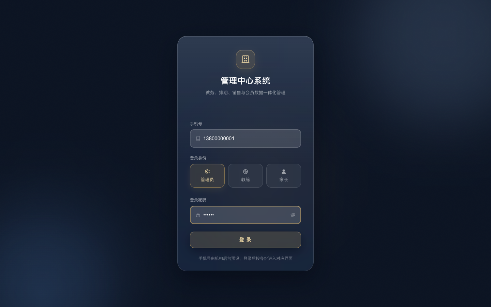
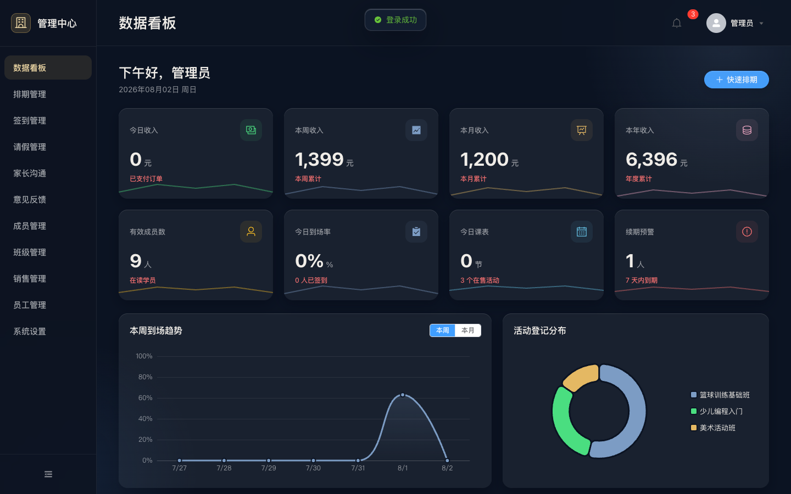
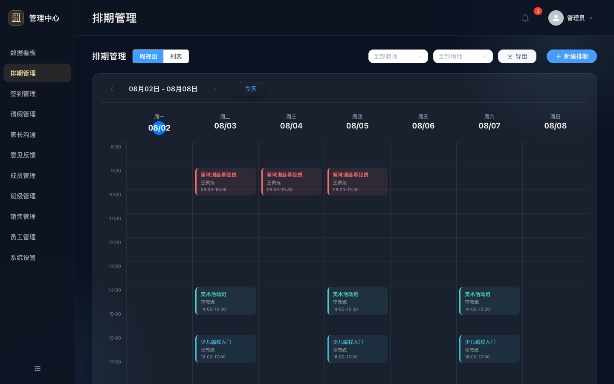
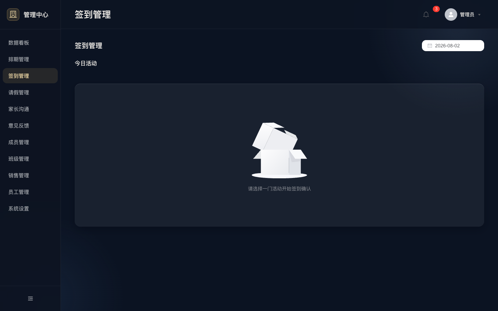
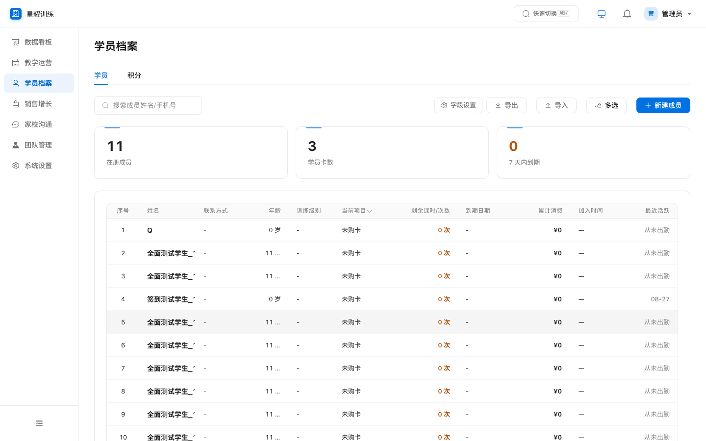
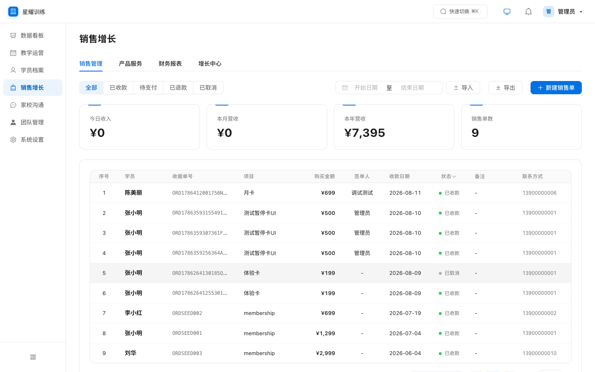
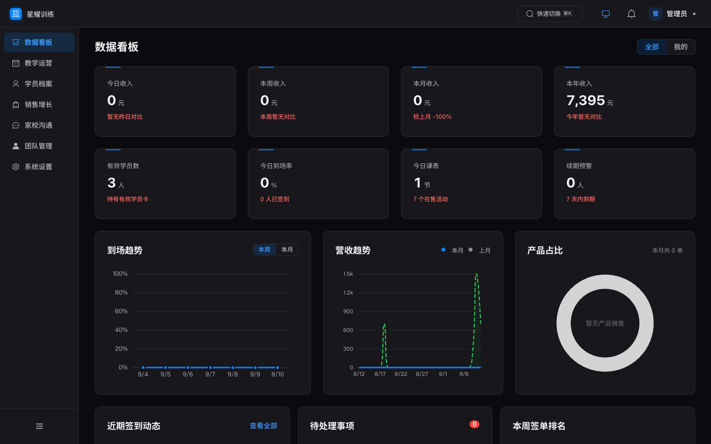
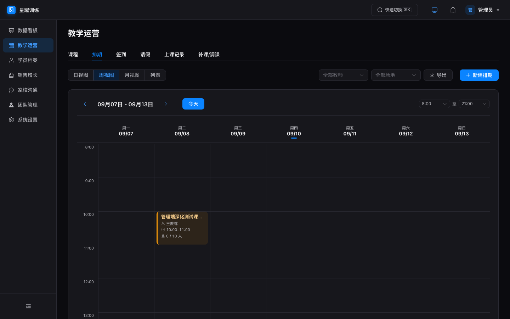

# 星课 StarClass · 教培 / 健身机构一体化管理系统

[](https://github.com/Mihooni/edu-admin/actions/workflows/ci.yml)
[](LICENSE)

> 专为小型与个人教培机构打造的一体化教务产品：**Web 管理后台 + API 后端**，覆盖招生、排课、考勤、家校沟通、销售、续费、薪资结算全流程。克隆即可在自己电脑或服务器一键部署；可选付费扩展提供家长 / 教练 / 管理三端微信小程序。

**零云服务依赖 · 数据完全归属机构 · clone 后一条命令跑起来**

---

## 🚀 一键部署（30 秒上手）

**方式 A · 本机 / 旧电脑直接跑（免 Docker）**

```bash
git clone https://github.com/Mihooni/edu-admin.git
cd edu-admin
bash deploy.sh
```

脚本自动完成：**安装依赖 → 初始化数据库（含示例数据）→ 构建管理端 → 启动服务**。

**方式 B · 正式上线到云服务器（Docker）**

```bash
git clone https://github.com/Mihooni/edu-admin.git
cd edu-admin
./deploy/deploy.sh --host app.yourdomain.com   # 自动 HTTPS；内网用 --no-https
```

单容器交付（API + 管理后台同端口），SQLite 在数据卷中跨升级保留。
也可在 GitHub Actions 里点 **Deploy → Run workflow** 完成全自动部署，
详见 [`deploy/README.md`](deploy/README.md)。

两种方式完成后打开：

| 服务 | 地址 | 说明 |
|---|---|---|
| 🖥️ 管理后台 | http://localhost:3001 | 后端同端口托管，单入口 |
| ⚙️ 后端 API | http://localhost:3001/api | 健康检查 `/api/health` |

**体验账号**（示例数据自动生成）：

| 身份 | 手机号 | 密码 | 入口 |
|---|---|---|---|
| 管理员 | `13800000001` | `123456` | Web 管理后台（工作台） |
| 教练 / 家长 | `13800000011`（王教练）、`13900000001`（小明爸爸）等 | `123456` / 无需密码 | 数据 API；可选付费三端小程序（见下文） |

> 上线前务必修改默认密码（管理后台 → 系统设置 → 账号安全）。

### 常用命令

```bash
bash deploy.sh        # 一键部署 / 重新部署（已有数据不会被动）
bash start-all.sh     # 日常启动（依赖/构建产物已就绪时更快）
bash stop-all.sh      # 停止服务
npm run smoke         # 冒烟测试（39 项，需服务运行中）
npm run test:backend  # 后端全量回归（256 项，隔离测试库，不动你的数据）
npm run verify        # 扩展验收套件（约 20 套件，需服务运行中，见 TEST-GUIDE.md）
```

### 生产环境必读

```bash
export JWT_SECRET=$(openssl rand -hex 32)   # 必填：生产环境未设置会拒绝启动
```

正式上线（公网服务器 + HTTPS 域名 + 数据备份）完整步骤见 **[`部署上线说明.md`](部署上线说明.md)**。

---

## ✨ 功能总览（Web 工作台）

- **数据看板**：今日/本周/本月/本年收入、签单排名、到场率、续期预警
- **排课**：周视图 / 列表、重复规则（每天/每周/按 N 天）、冲突检测、公开活动报名、补课 / 调课
- **考勤**：一键点名、签到统计、迟到 / 缺席自动通知家长
- **成员**：学员 / 家长档案、会员卡暂停 / 恢复（按暂停天数顺延）、多孩家庭绑定、续费提醒（15/7/1 天可配）
- **家校沟通**：站内通知下发、反馈回复闭环、成长记录（教练课后点评）
- **销售**：签单开卡自动激活权益、批量导入、自定义退费、财务汇总
- **薪资**：课时 / 人头 / 混合计费，课时费规则可视化配置
- **可定制**：机构称呼自定义（老师/学员/会员…全站替换）、表格字段配置、积分 / 退费 / 请假规则全部可配
- 🌙 **深色模式**：跟随系统 / 浅色 / 深色三档切换

### 💰 可选付费扩展：三端微信小程序
家长端 / 教练端 / 管理员端原生小程序（41 页）不随本仓库发布，作为商业扩展单独提供：
会员身份卡与报名、扫码签到、请假补课、积分商城、订单、成长档案、课后点评、订阅消息提醒（开课/续费/余额）。
后端 API 已为小程序预留微信登录、支付与订阅消息能力，购买部署授权后即可对接你自己的小程序。
获取方式：在 [Issues](https://github.com/Mihooni/edu-admin/issues) 留言联系。

---

## 🧱 技术架构

```
┌─────────────────────────────────────────────────┐
│  Express 后端（Node.js）                          │
│  22 组路由 · JWT 鉴权 · bcrypt 密码 · 角色门控      │
│  自动备份 · 迁移系统（幂等）· 限流                   │
├─────────────────────────────────────────────────┤
│  SQLite（better-sqlite3, WAL）                    │
│  单文件数据库 · 数据完全归属机构                     │
└──────────────────┬──────────────────────────────┘
                   │ 同端口静态托管
┌──────────────────▼──────────────────────────────┐
│  Web 管理后台（Vue3 + Element Plus + Vite）       │
│  首页工作台 · 7 大业务模块 · 单入口 :3001           │
│  深色模式 · 浅色 / 深色 / 跟随系统                  │
└─────────────────────────────────────────────────┘
   （可选付费扩展：家长 / 教练 / 管理三端微信小程序，
     经 HTTPS + Bearer Token 对接上述后端 API）
```

| 端 | 技术栈 | 位置 |
|---|---|---|
| 后端 | Node.js + Express + better-sqlite3 | `backend/` |
| Web 管理端 | Vue3 + Element Plus + ECharts + Vite | `web-admin/` |

**运行成本为零**：无云服务、无数据库服务、无消息队列，一台 1 核 2G 云服务器或一台旧笔记本即可长期运行。

---

## 📸 界面预览

**浅色模式**

| 登录 | 数据看板 | 排课管理 |
|---|---|---|
|  |  |  |

| 点名签到 | 成员档案 | 订单管理 |
|---|---|---|
|  |  |  |

**🌙 深色模式**（跟随系统 / 浅色 / 深色三档切换）

| 数据看板 | 排课管理 |
|---|---|
|  |  |

更多截图（班级 / 请假 / 积分 / 增长 / 通知 / 反馈 / 员工 / 教练课时 / 设置）见 [`docs/screenshots/`](docs/screenshots/)。

---

## 🛠 长期稳定运行（运维三件事）

```bash
# 1. 备份 —— 数据全在单文件 backend/db/data.db（每日自动备份在 backend/backups/，Web 端可一键下载）
sqlite3 backend/db/data.db ".backup 'backup-$(date +%F).db'"

# 2. 升级 —— 拉新代码后重跑一键部署（不会动你的数据）
git pull && bash deploy.sh

# 3. 看日志 / 健康检查
tail -50 backend.log
curl http://localhost:3001/api/health
```

服务器 7×24 运行推荐用 pm2 守护：`npm i -g pm2 && cd backend && pm2 start server.js --name starclass && pm2 save`。完整公网部署（域名 / HTTPS）见 [`部署上线说明.md`](部署上线说明.md)。

---

## ❓ 常见问题（FAQ 速查）

| 问题 | 答案 |
|---|---|
| Node 版本要求？ | **>= 18**（推荐 20/22）。装好后再跑 `bash deploy.sh` |
| 依赖安装报错 / better-sqlite3 编译失败？ | 缺编译环境：macOS 执行 `xcode-select --install`；Linux 执行 `apt install build-essential python3` |
| 端口 3001 被占用？ | 先 `bash stop-all.sh`；仍占用则 `export PORT=3002 && bash start-all.sh` |
| 忘记管理员密码？ | 删除示例库重来（`rm backend/db/data.db*` → `npm run init:db && npm run seed`）；正式数据请勿删库，在后台「系统设置 → 账号安全」修改 |
| 想清空示例数据正式使用？ | 管理后台逐个删除演示学员/订单即可，或删 `backend/db/data.db*` 后只跑 `npm run init:db`（不 seed）从零录入 |
| 换电脑 / 迁移服务器？ | 拷走 `backend/db/data.db` + `backend/uploads/` 两个位置，新机重跑 `bash deploy.sh` 后放回数据文件即可 |
| 三端小程序怎么获取？ | 家长 / 教练 / 管理端小程序为付费商业扩展，不在本仓库内；在 Issues 留言联系获取部署授权 |
| 不配微信小程序能用吗？ | 能。Web 工作台手机号 + 密码登录全功能可用；后端预留 `WX_APPID`/`WX_SECRET` 供小程序扩展对接 |

完整排障表 + 各角色操作说明见 **[`docs/常见问题FAQ.md`](docs/常见问题FAQ.md)** 与 **[`使用手册.md`](使用手册.md)**。

---

## 📖 文档

| 文档 | 内容 |
|---|---|
| [`使用手册.md`](使用手册.md) | 各角色日常操作说明（招生 → 排课 → 考勤 → 续费全流程） |
| [`docs/常见问题FAQ.md`](docs/常见问题FAQ.md) | 安装 / 使用 / 迁移 / 排障 全量问答 |
| [`部署上线说明.md`](部署上线说明.md) | 公网部署、HTTPS、合法域名、数据备份 |
| [`deploy/README.md`](deploy/README.md) | Docker 一键部署（含 GitHub Actions 点一下部署） |
| [`TEST-GUIDE.md`](TEST-GUIDE.md) | 改代码后的验证与回归门禁 |
| [`DESIGN.md`](DESIGN.md) | 设计系统规范（色彩 / 字体 / 组件 / 间距，含深浅色 token） |
| [`CONTRIBUTING.md`](CONTRIBUTING.md) · [`SECURITY.md`](SECURITY.md) · [`CHANGELOG.md`](CHANGELOG.md) | 贡献指南 / 漏洞报告 / 版本记录 |

---

## 🔒 安全设计

- JWT 鉴权 + 角色门控，家长 / 教练 / 管理员数据严格隔离
- 密码 bcrypt 存储；资金操作（订单导入 / 积分消耗 / 退款 / 审批）全部事务化
- 生产环境强制 `JWT_SECRET`，未配置直接拒绝启动
- 登录限流 100 次 / 15 分钟，全局限流 200 次 / 分钟
- 每日自动备份（`backend/backups/`），Web 端支持一键备份下载

---

## 打赏支持

如果这个项目对你有帮助，欢迎请作者喝杯咖啡 —— 每一杯都是持续更新的动力 ☕

<p align="center">
  &nbsp;&nbsp;
  
</p>

## 📝 License

MIT
